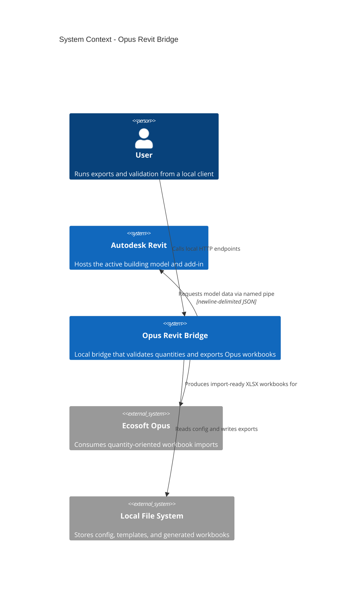
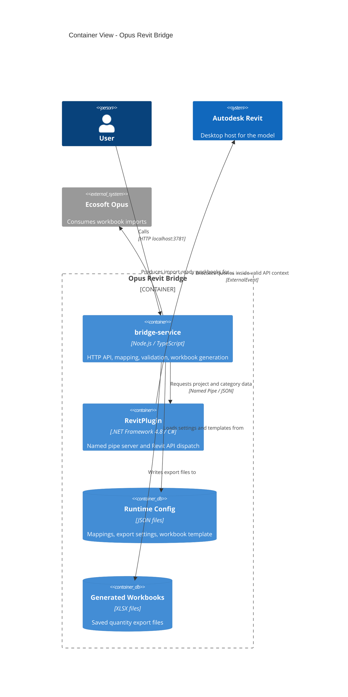

# Architecture Diagram

## Container View

## Notes

- The context diagram shows the system boundary and its external relationships.
- The container diagram shows the core Brain and Hands split inside the system.
- The Node service owns orchestration, mapping, validation, and XLSX generation.
- The Revit plugin stays thin and only executes Revit API work through ExternalEvent on the Revit UI thread.
