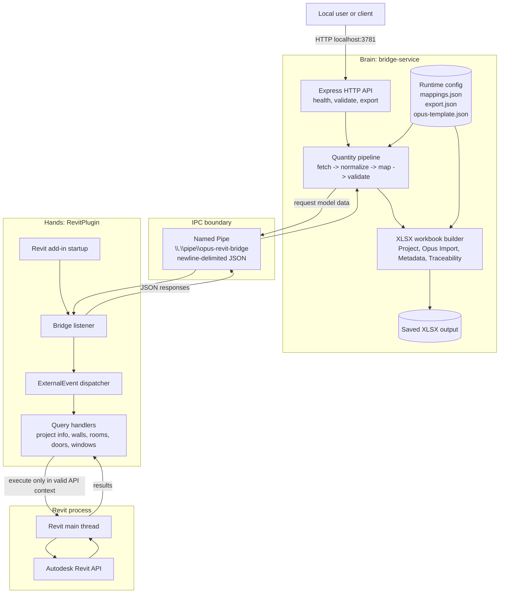

# Architecture Diagram

## Notes

- This view is intentionally simplified for PDF export.
- The key boundary is Brain versus Hands: the Node service never calls the Revit API directly.
- All Revit API execution is routed through ExternalEvent onto the Revit main thread.