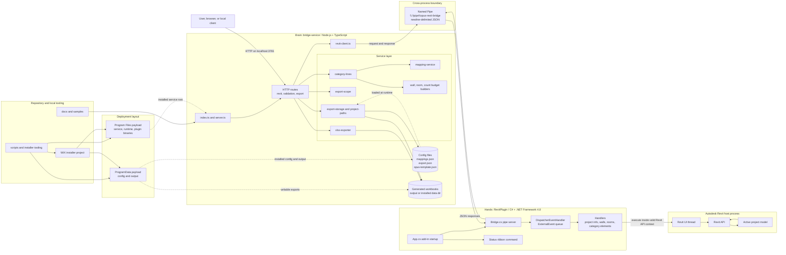

# Architecture Diagram

## Notes

- This view is broader than the runtime-only sketch and includes repository, deployment, and service-layer structure.
- The key architectural rule is still the Brain versus Hands split: the Node service never calls the Revit API directly.
- All Revit API work is dispatched through ExternalEvent onto the Revit UI thread.
- The service owns mapping, validation, workbook generation, and runtime path resolution.
