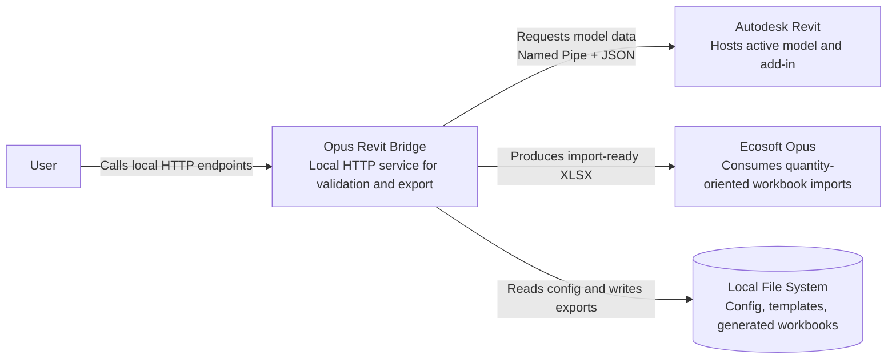
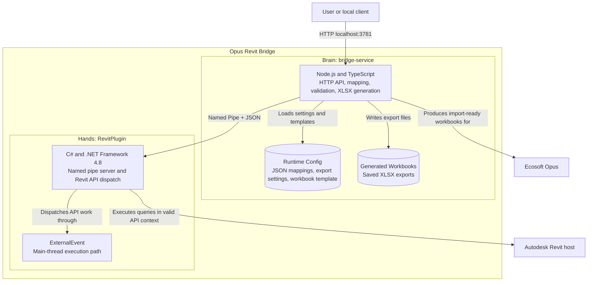

# Architecture Diagram

## Container View

## Notes

- The context diagram is now a standard Mermaid flowchart for broader renderer compatibility.
- The container diagram is also plain flowchart syntax so it should render more reliably in VS Code previews.
- The Node service owns orchestration, mapping, validation, and XLSX generation.
- The Revit plugin stays thin and only executes Revit API work through ExternalEvent on the Revit UI thread.
